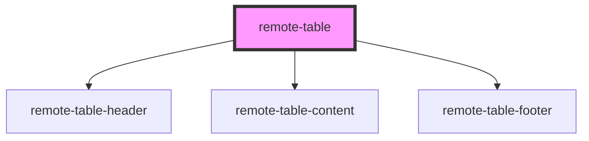

# remote-table

<!-- Auto Generated Below -->

## Properties

| Property     | Attribute     | Description | Type     | Default     |
| ------------ | ------------- | ----------- | -------- | ----------- |
| `footerText` | `footer-text` |             | `string` | `undefined` |
| `remoteUrl`  | `remote-url`  |             | `string` | `undefined` |
| `tableTitle` | `table-title` |             | `string` | `undefined` |

## Dependencies

### Depends on

- [remote-table-header](../remote-table-header)
- [remote-table-content](../remote-table-content)
- [remote-table-footer](../remote-table-footer)

### Graph

----------------------------------------------

*Built with [StencilJS](https://stenciljs.com/)*
